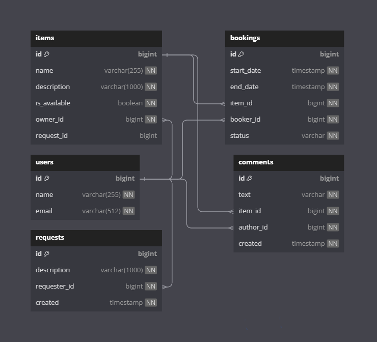

# ShareIt
**ShareIt** - проект, предоставляющий пользователям, во-первых, возможность рассказывать, 
какими вещами они готовы поделиться, а во-вторых, находить нужную вещь и брать её в аренду на какое-то время. 
Сервис не только позволяет бронировать вещь на определённые даты,
но и закрывать к ней доступ на время бронирования от других желающих.
На случай, если нужной вещи на сервисе нет, у пользователей имеется возможность оставлять запросы. 
По запросу можно будет добавлять новые вещи для шеринга.

---

**Технологии:** Java + Spring Boot + Maven + RESTful API + Hibernate + Lombok + PostgreSQL + JUnit5 + Mockito + Docker

---

## Микросервисная архитектура
Приложение состоит из 2 сервисов:
- **gateway -** сервис, с которым непосредственно работают пользователи. 
Выполняет приём запросов, их валидацию, а также возвращает пользователю ответ от сервера;
####
- **server -** серверная часть приложения, содержит основную логику, взаимодействует с базой данных.
---

## Эндпоинты

- POST /bookings - добавляет запрос на бронирование вещи.
- PATCH /bookings/{bookingId} - подтверждение или отклонение запроса на бронирование.
- GET /bookings/{bookingId} - получение данных о бронировании (включая его статус).
- GET /bookings?state={state}from={from}&size={size} - получение списка бронирований текущего пользователя.
- GET /bookings/owner?state={state}from={from}&size={size} - получение списка бронирований всех вещей текущего пользователя.
---
- POST /items - добавить вещь.
- PATCH /items/{id} - обновление вещи.
- GET /items - получение списка вещей текущего пользователя.
- GET /items/{id} - получение данных о вещи.
- GET /items/search - поиск доступных вещей по наименованию и описанию.
- POST /items/{itemId}/comment - добавление отзывов на вещь после того, как взяли её в аренду.
---
- POST /requests - добавить запрос вещи.
- GET /requests - получить список запросов текущего пользователя.
- GET /requests/{requestId} - получить данные о запросе.
- GET /requests/all?from={from}&size={size} - получить список запросов, созданных другими пользователями.
---
- POST /users - добавить нового пользователя.
- PATCH /users/{id} - обновление пользователя.
- DELETE /users/{id} - удаление пользователя.
- GET /users/{id} - получить данные о пользователе.
- GET /users - получить данные о всех пользователей.
---

## Схема базы данных


---

## Установка и запуск проекта
Необходимо настроенная система виртуализации, установленный Docker Desktop(скачать и установить можно
с официального сайта https://www.docker.com/products/docker-desktop/)

1. Клонируйте репозиторий проекта на свою локальную машину:
   ```
   git clone git@github.com:kaldubasina/java-shareit.git
   ```
2. Запустите коммандную строку и перейдите в коррень директории с проектом. 
####
3. Соберите проект
   ```
   mvn clean install
   ```
4. Введите следующую команду, которая подготовит и запустит приложение на вашей локальной машине
   ```
   $  docker-compose up
   ```
5. Приложение будет запущено на порту 8080. Вы можете открыть свой веб-браузер и перейти 
по адресу `http://localhost:8080`, чтобы получить доступ к приложению ShareIt.

---